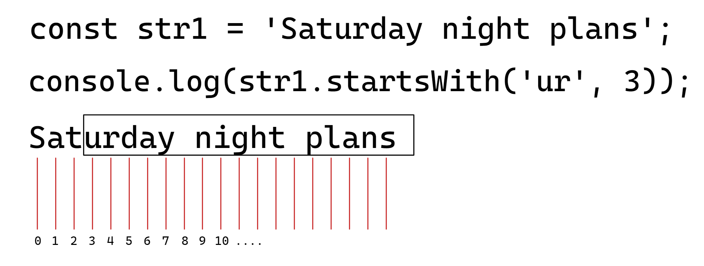
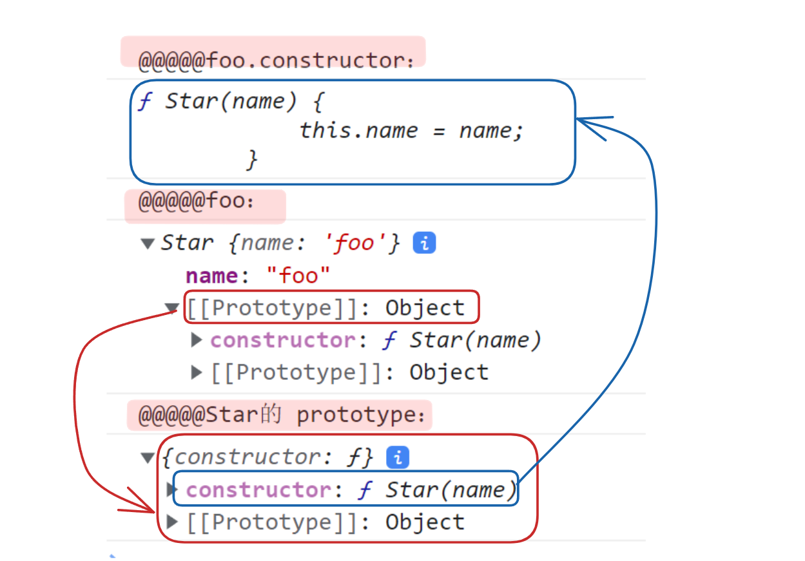
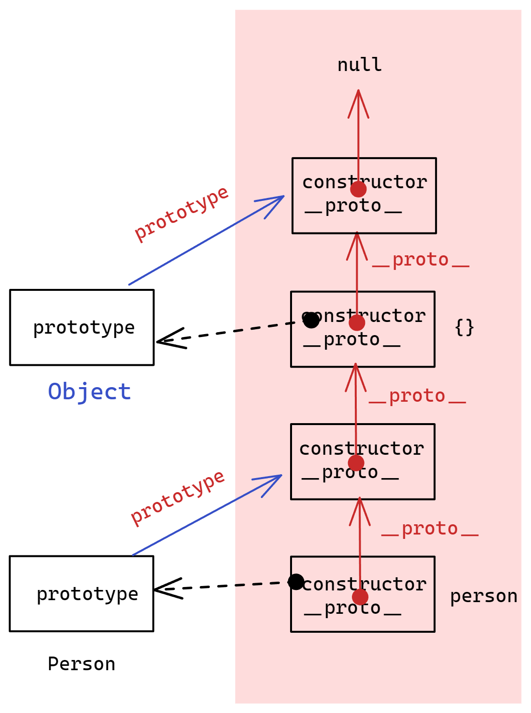
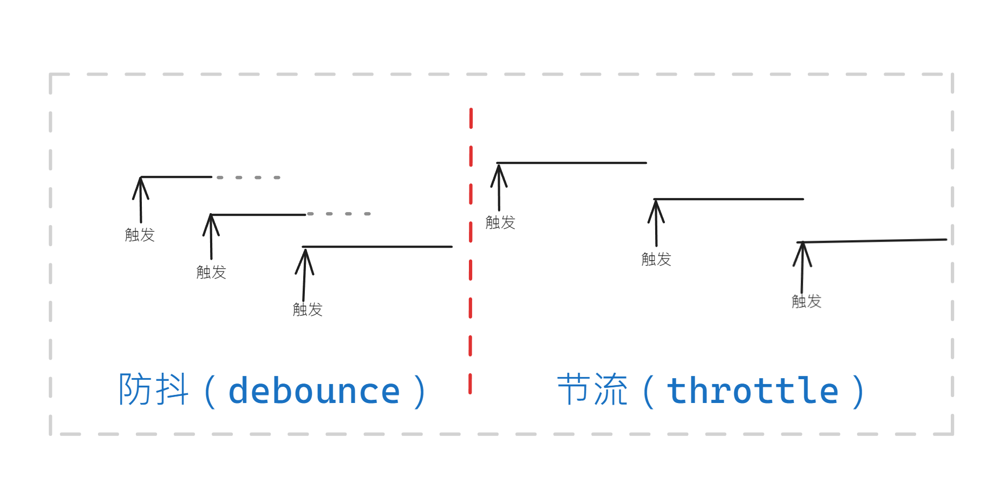
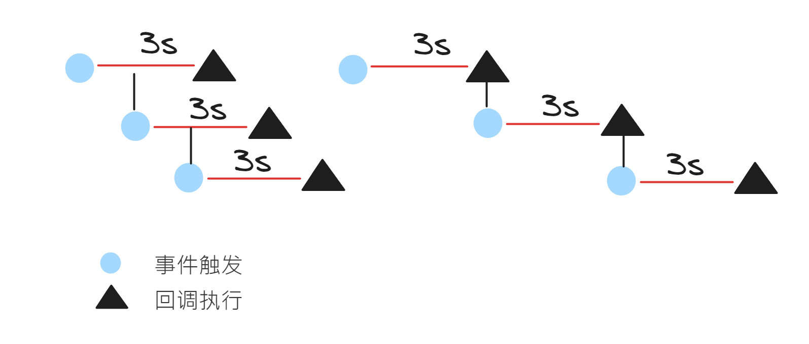

# ES6 视频学习笔记

> 学习计划：一集视频一个提交，如果可能的话。
>
> 学习周长：7 天内完成（2023 年 5 月 13 日-???），每天 6-7 集。

学习大纲（ JS 进阶 ）

- Day01-作用域&解构&箭头函数
- Day02-构造函数&数据常用函数
- Day03-深入面向对象
- Day04-高阶技巧

知识要点

Day01-作用域&解构&箭头函数

1. 作用域
   - 局部作用域
   - 全局作用域
   - 作用域链
   - JS 垃圾回收机制
   - 闭包
   - 变量提升
2. 函数进阶
   - 函数提升
   - 函数参数
   - 箭头函数
3. 解构赋值
4. 综合案例

Day02-构造函数&数据常用函数

1. 深入对象
   - 创建对象的三种方式
   - 构造函数
   - 实例成员&静态成员
2. 内置构造函数
3. 综合案例

Day03-深入面向对象

1. 编程思想
2. 构造函数
3. 原型
   1. 原型
   2. contructor 属性
   3. 对象原型
   4. 原型继承
   5. 原型链
4. 综合案例

Day04-高阶技巧

1. 深浅拷贝
2. 异常处理
3. 处理 this
4. 性能优化
5. 综合案例

## -------阶段一--------

## 作用域和作用域链

---

回顾作用域

- 作用域(scope)规定了变量能够被访问的“范围”，离开了这个“范围”变量便不能被访问。
- 作用域基本分为：（1）局部作用域；（2）全局作用域。

### 局部作用域

局部作用域又分为：（1）函数作用域；（2）块作用域（block）

1. 函数作用域

在函数内部声明的变量只能在函数内部被访问，**外部**无法直接访问。

```javascript
<script>
    function getSum(){
            // num 在函数内部，而函数内部是函数作用域，所以 sum是局部变量
            const num = 10;
            return sum;
    }
    //  因此 在外部无法直接访问 sum，会报错
    console.log("sum为",sum); // ReferenceError: sum is not defined
</script>
```

小结：

- **函数内**声明的变量以及**函数的参数**都是函数内部的局部变量，在函数外部无法被访问。

- 不同函数内部的声明的变量互相也无法访问。

- 函数执行完，函数内的变量被清空。

2. 块作用域

在 JavaScript 中使用`{}`包裹的代码称为代码块（如 `for`,`if`,...），代码块内部声明的变量外部将【有可能】无法被访问。

```javascript
for (let i = 0; i < 10; i++) {
	// {} 内部成为 块作用域, i 是局部变量，外部不能访问
	// console.log(i);
}
console.log(i); //  Uncaught ReferenceError: i is not defined
```

小结：

- 使用`let`,`const`关键字声明的变量会产生块作用域，而`var`不会。（推荐使用`const`或`let`）
- 不同代码块之间变量无法直接访问。

### 全局作用域

`<script>`标签和`.js`文件的【最外层】就是所谓的全局作用域，在此声明的变量在函数内部也可以被访问。
全局作用域中声明的变量，任何其它作用域都可以被访问

注意：

- 给 `window` 对象添加的属性默认是全局的，函数中未使用 关键字声明的变量也是全局的，都不建议使用！
- 尽可能减少使用全局变量，防止全局变量被污染。

### 作用域链

作用域链本质上是底层的**变量查找机制**。

- 在函数被执行时，会**优先查找当前**函数作用域中查找变量
- 如果当前作用域查找不到则会**依次逐级查找父级作用域**直到全局作用域

小结：

1. 嵌套关系的作用域串联起来形成了作用域链
2. 相同作用域链中按着从小到大的规则查找变量
3. 子作用域能够访问父作用域，**但父级作用域无法访问子级作用域！**

---

## JS 垃圾回收机制及算法

### 内存生命周期

JS 环境中分配的内存，一般有如下生命周期：

1. 内存分配：当我们声明变量、函数、对象的时候，系统会自动为他们分配内存
2. 内存使用：即读写内存，也就是使用变量、函数等
3. 内存回收：使用完毕，由**垃圾回收器**自动回收不再使用的内存

说明：

- 全局变量一般不会回收（关闭页面回收）
- 一般情况下**局部变量**的值，不用了，会被**自动回收**掉

> 内存泄漏：程序中分配的内存由于某种原因程序**未释放**或**无法释放**叫做**内存泄漏**

### 堆栈空间分配说明

1. 栈（操作系统）：由**操作系统自动分配释放**函数的参数值、局部变量等，基本数据类型放到栈里面。
2. 堆（操作系统）：一般由程序员分配释放，若程序员不释放，由**垃圾回收机制回收**。**复杂数据类型**放到堆里面。

### 垃圾回收算法

#### 引用计数法

IE 采用的引用计数算法，定义“**内存不再使用**”，就是看一个**对象**是否有指向它的引用，没有引用了就回收对象

算法：

1. 跟踪记录被引用的次数
2. 如果被引用了一次，那么就记录次数 1，多次引用会**累加++**
3. 如果减少一个引用就减`1--`
4. 如果引用次数是 0，则释放内存

引用计数法存在问题：循环引用可能导致内存泄露！

```javascript
function fun() {
	let o1 = {};
	let o2 = {};
	// 下面的 o1,o2循环引用，可能导致内存泄露！
	o1.a = o2;
	o2.a = o1;
	return "引用计数法无法回收";
}
fun(); // 调用
```

#### 标记清除法

**现代的浏览器已经不再使用引用计数算法了**。

**现代浏览器通用的大多是基于标记清除算法的某些改进算法**，总体思想都是一致的。

核心：

1. 标记清除算法将“**不再使用的对象**”定义为“**无法达到的对象**”。
2. 就是从**根部**(在 S 中就是全局对象)出发定时扫描内存中的对象。凡是能从根部到达的对象，都是还需要使用的。
3. 那些无法由根部出发触及到的**对象被标记为不再使用**，稍后进行回收。

> 引用计数法存在的问题以及标记清除法解决的问题；
>
> 1. 函数内部的局部变量应当在函数被调用结束后被销毁（回收），但假如在函数中存在循环引用，使用引用计数法则不会被回收，如此一来可能会造成内存泄露。
> 2. 使用标记清除法可以解决函数内部变量循环引用导致无法垃圾回收造成的内存泄露。目的是函数内部（局部变量）垃圾回收问题。

---

## 闭包

闭包（closure）：一个函数对周围状态的引用捆绑在一起，内层函数中访问到其外层函数的作用域

> 简单理解：闭包=内层函数+外层函数的变量

闭包的使用

- 闭包的基本结构

- 常用闭包的结构

- 闭包的应用

1. 闭包的基本结构

```javascript
function outer(params) {
	const a = 1;
	function inner(params) {
		console.log(a);
	}
	inner();
}
outer();
```

2. 常用闭包的结构

在实际使用中，闭包并不是像前面一样，在外部函数（outer）内部调用内部函数（inner）来访问外部函数的中的变量。而是希望在全局作用域（函数外部）访问。因此常用的闭包结构如下：

```javascript
function outer() {
	const a = 1;
	function inner() {
		console.log(a);
	}
	// 返回外部函数中内部函数 inner
	return inner;
}
const a = outer();
a(); // 外部调用 inner(),访问函数内变量
```

3. 闭包的应用
   闭包应用：**实现数据的私有**
   比如，我们要做个统计函数调用次数，函数调用一次，就++

```javascript
// -----------------1.不使用闭包-----------------
let i = 0; // 全局作用域的变量容易被修改
function counter() {
	i++;
}
// -----------------2.使用闭包-----------------
/**
     注意：此时 i 虽然是 函数内的局部变量，但是但函数执行完后 i 并不会被回收。
    因为 counter返回 fun的引用，f 指向了 fun，fun中的 i 可以被“找到”，不会被回收
    但是这样会导致 i 一直不回收，可能会导致 内存泄露
*/
function counter() {
	let i = 0;
	function fun() {
		i++;
		console.log(`函数被调用了${i}次`);
	}
	return fun;
}
const f = counter();
```

---

## 变量提升和函数提升

### 变量提升

变量提升是 avaScript 中比较“奇怪”的现象，它允许在变量声明之前即被访问(仅存在于 var 声明变量)

- 变量在未声明即被访问时会报语法错误。
- 在使用`var`,`let`,`const`中，只有使用`var`声明的变量存在变量提升。变量在`var`声明之前即被访问，变量的值为`undefined`（相当于只提升变量的声明，不提升赋值）。
- 变量提升出现在相同作用域中。
- 实际开发中推荐先声明，后访问。

```javascript
// 1. 变量提升：把所有var 声明的变量的声明提到 【当前作用域】的最前面
console.log(num, " 件"); // undefined 件
var num = 10;
// 上述代码相当于
/**
        var num;
        console.log(num, "件"); // 因此num声明但位赋值，默认值为 undefined
        num = 10;
        */
function fun() {
	console.log(num, " 件"); // undefined 件
	var num = 10;
}
fun();
```

### 函数提升

两种情况

- 普通函数的函数提升
- 函数表达式的函数变量的提升

普通函数的函数提升

```javascript
// 1. 函数提升：只提升函数声明，不提升调用
fun(); // 在函数声明前调用函数
function fun() {
	console.log("函数被调用了");
}
/**
上述的代码相当于

function fun() {
     console.log("函数被调用了");
}

fun(); // 在函数声明前调用函数
*/
```

函数表达式的函数变量的提升

```javascript
// 函数表达式
fun2();
var fun2 = function () {
	console.log("函数表达式"); //Uncaught TypeError: fun2 is not a function
};
/*
上述的代码由于是 函数表达式，存在 变量的提升，
因此相当于在 fun2赋值之前调用fun2(),此时fun2 为 undifiend，因此 fun2 不是函数，会报错
*/
```

## 函数参数和展开运算符

函数参数类型

- 动态参数
- 剩余参数

1，动态参数

- 特点：arguments 是伪数组，仅存在函数中，可以获取传给函数的所有实参

```javascript
function getSum() {
	// arguments 伪数组，仅存在函数中，可以获取传给函数的所有实参
	console.log(arguments);
	let sum = 0;
	for (let i = 0; i < arguments.length; i++) {
		sum += arguments[i];
	}
	console.log("sum: ", sum); // sum: 15
}
getSum(1, 2, 3, 4, 5);
```

2,剩余参数

- 特点：rest 是真数组，可接受所有剩余的参数。剩余参数可以随意命名。

```javascript
function getSum(a, ...rest) {
	// rest 是真数组，可接受所有剩余的参数
	console.log("rest: ", rest);
	let sum = 0;
	for (let index = 0; index < rest.length; index++) {
		sum += rest[index];
	}
	console.log("sum: ", sum); // sum: 15
}
getSum(1, 2, 3); // 剩余此参数是 [2,3]
getSum(1, 2, 3, 4, 5); // 剩余此参数是 [2,3,4,5]
```

3，扩展：展开运算符

特点：不会修改原有数组。

展开运算符经常用于 求数组元素 **最大值/最小值** 或 **合并数组** 的需求中，在形参数中使用展开运算符。

```javascript
const arr = [1, 2, 3];
console.log(...arr); // 1 2 3
// 1. 求数组元素最大值,最小值
const maxValue = Math.max(...arr);
const minValue = Math.min(...arr);
console.log("maxValue: ", maxValue); // maxValue:  3
console.log("minValue: ", minValue); // minValue:  1
// 2. 合并数组
const arr2 = [3, 4, 5];
const arr3 = [...arr, ...arr2];
console.log("arr3: ", arr3); //  [1, 2, 3, 3, 4, 5]
```

---

## ES6 箭头函数的使用

## ES6 箭头函数的使用

目的：引入箭头函数的目的是更简短的函数写法并且不绑定`this`，箭头函数的语法比函数表达式更简洁
使用场景：箭头函数更适用于那些**本来需要匿名函数**的地方

### 箭头函数的基本使用

```javascript
// 普通函数
const fn = function () {
	console.log("普通函数");
};
// 1. 箭头函数：一般形式
// 箭头函数属于表达式函数，因此不存在 函数提升
const fn2 = (a, b, c) => {
	console.log("箭头函数");
};
// 3. 箭头函数：形参只有一个，则可省略参数 '()'
const fn3 = (a) => {
	console.log("a:", a);
};
// 4. 箭头函数：函数体只有一个语句，则可省略 '{}'
const fn4 = (b) => console.log("b:", b);
// 5. 箭头函数：函数体只有一个语句，且是 return 返回语句，则可以省略 return ,省略 '{}'
const fn5 = (c) => c++;
// 6. 箭头函数：返回值可以是一个对象
const fn6 = (name) => ({ username: name });
```

### 箭头函数的参数

箭头函数中没有 `arguments`，只有 剩余参数`...rest`

```javascript
// 利用箭头函数求和
// 箭头函数中没有 arguments ，只有 剩余参数 ...rest
const getSum = (...rest) => {
	let sum = 0;
	for (let index = 0; index < rest.length; index++) {
		sum += rest[index];
	}
	console.log("sum: ", sum); // sum:  87
};
getSum(1, 1, 2, 3, 5, 8, 13, 21, 33);
```

### 箭头函数 this

箭头函数**不会创建自己的 this**,它只会从**自己的作用域链的上一层**沿用 thiS。

在开发中 **使用箭头函数前需要考虑函数中 this 的值** ，事件回调函数使用箭头函数时，`this`为全局的`window`,因此 `DOM`事件回调函数为了简便，**还是不太推荐使用箭头函数**

```javascript
// -----------------1. 普通函数的 this-----------------
console.log(this); // window
function fn() {
	console.log(this); // window
}
windows.fn();
const obj = {
	name: "foo",
	sayHi: function () {
		console.log(this); // obj
	},
};
obj.sayHi();
// -----------------2. 箭头函数的 this-----------------
const fn1 = () => {
	// 箭头函数的 this 指向上一层作用域的 this
	console.log(this); // window
};
fn1();
// 对象方法的箭头函数
const obj2 = {
	name: "foo",
	sayHi: () => {
		// 箭头函数的 this 指向上一层作用域的 this
		console.log(this); // window
	},
};
obj2.sayHi();
// 对象方法的箭头函数
const obj3 = {
	name: "foo",
	sayHi: function () {
		let i = 10;
		// 当前作用域的 this 是 obj3
		const cont = () => {
			// 箭头函数的 this 指向上一层作用域的 this
			console.log(this); // obj3
		};
	},
};
obj3.sayHi();
```

## 解构赋值

### 数组解构

数组解构是将数组的单元值**快速批量赋值**给一系列变量的**简洁语法**

基本语法：

1. 赋值运算符`=`左侧的`[]`用于批量声明变量，右侧数组的单元值将被赋值给左侧的变量
2. 变量的顺序**对应数组单元值的位置**依次进行赋值操作

1，基本使用

```javascript
// 1. 数组解构：基本使用
const arr = [100, 200, 300];
const [max, min, avg] = arr;
console.log("max: ", max); // max:  100
console.log("min: ", min); // min:  200
console.log("avg: ", avg); // avg:  300
// 2. 数组解构：交换变量的值
let a = 1;
let b = 2;
[a, b] = [b, a];
console.log(`a是${a},b是${b}`); // a是2,b是1
```

2，⚠️ 必须加分号的两种情况

```javascript
// 1. 立即执行函数需要添加 ';'
(function () {})();

// 2. 使用数组的时候
// const arr = [1, 2, 3];
const str = "foo"[
	// const str = 'foo'; // 使用封号
	(1, 2, 3)
].map(function (item) {
	console.log("item:", item); // Uncaught TypeError: Cannot read properties of undefined (reading 'map')
});
/*
    如果上述代码 const str = 'foo' 后 无 ';'，则代码解析会成为
    const str = foo[1,2,3],map...  这样的结构，而没有 foo[1,2,3] 这样的数组，因此没有
    map()方法，就会出错
*/
```

3，数组解构细节

```javascript
// 1. 赋值元素数量 大于 解构元素数量，则未赋值元素值为 undefine
const [a, b, c, d] = [1, 2, 3];
console.log(a, b, c, d); // 1 2 3 undefined

// 2. 赋值元素数量 小于 解构元素数量，则有多余的
// 3. 使用剩余参数接收剩余的值
const [x, y, ...rest] = [4, 5, 6, 7];
console.log("x, y: ", x, y); // x, y:  4 5
console.log("rest: ", ...rest); // rest:  6 7

// 4. 为了防止因 出现（1）的情况，可以给赋值元素设置 默认值
const [m, n, p = 30, q = 40] = [10, 20];
console.log("m,n: ", m, n); // m,n:  10 20
console.log("p ", p); // p  30
console.log("q ", q); // q  40

// 5. 按需导入（赋值)解构元素
// 比如下面的 l 不是 '3' 而是 '4' ，因为空出了一个元素
const [h, j, , l] = [1, 2, 3, 4];
console.log("h,j: ", h, j); // h,j:  1 2
console.log("l: ", l); // l:  4

// 6. 支持 多维数组 的数组解构
const arr = [1, 2, [3, 4]];
const [k, r, s] = arr;
console.log("k,r: ", k, r); //  k,r:  1 2
console.log("s: ", s); // s:  [3, 4]
const [u, v] = s;
console.log("u,v: ", u, v); // u,v:  3 4
/**
    上述 s 表示 [3,4] 即原数组第三个元素。然后在对 s 解构
    即 [u,v] = s，u为3,v为4
    也可以一步到位
    const [k,r,[s,t]] = arr 
    k为1,r为2,s为3,t为4
*/
```

### 对象解构

对象解构是将**对象属性**和**方法**快速批量赋值给一系列变量的简洁语法

```javascript
// 1. 直接解构赋值给同名属性变量
const { name, age } = { name: "foo", age: 18 };
console.log("name: ", name, "age: ", age); // name:  foo age:  18

// 2. 赋值非同属姓名变量
const { name: uname, age: uage } = { name: "bar", age: 20 };
console.log("uname: ", uname, ",uage: ", uage); // uname:  bar ，uage:  20

// 3. 解构数组对象（数组元素是对象）
const pig = [{ uname: "peiqi", uage: 15 }];

const [{ uname: name2, uage: age2 }] = pig;
console.log("name2: ", name2, ",age2: ", age2); // nname2:  peiqi ,age2:  15

// 4. 多级对象解构
const pigs = {
	name: "peipi",
	family: {
		mother: "mompig",
		father: "pappig",
		brother: "George",
	},
	age: 6,
};
const {
	family: { brother },
} = pigs;
console.log("brother: ", brother); // brother:  George
```

对象解构的其他使用

- 作为函数形参解构

## foreach 遍历数组

## foreach 遍历数组

遍历数组的方法除了有`map`，可以用 `foreach`。相比`map`，`foreach`不会返回数组，使用上类似。

```javascript
// 使用foreach遍历数组
const arr = ["red", "green", "blue"];
const result = arr.forEach((item, index) => {
	console.log("item: ", item, "index: ", index);
});
/*
         item:  red index:  0
         item:  green index:  1
         item:  blue index:  2
*/
```

## 渲染商品案例

<https://www.bilibili.com/video/BV1VL411h72F/?p=11&spm_id_from=pageDriver&vd_source=bc02b194f06ee6c081a8d33ad7b3824d>

## 综合案例-筛选商品案例

数组的`filter()`方法的简单使用

特点：将原数组中满足条件的元素放到新数组中，不改变原数组。

```javascript
const arr = [10, 20, 30, 40];
const result = arr.filter(function (item, index) {
	return item > 10;
});
console.log("result: ", result); // result:  [20, 30, 40]
```

代码：<https://github.com/martinniee/ES6/blob/main/Day02/20_%E7%BB%BC%E5%90%88%E6%A1%88%E4%BE%8B.html>

预览：<https://htmlpreview.github.io/?https://github.com/martinniee/ES6/blob/main/Day02/20_%E7%BB%BC%E5%90%88%E6%A1%88%E4%BE%8B.html>

## --------阶段 2----------

## 创建对象的三种方式

```javascript
// 1. -----------------传统创建对象的方式：对象字面量-----------------
const o = {
	name: "foo",
};
console.log("o: ", o); // o:  {name: 'foo'}
// 2. -----------------创建对象：使用 new Object()-----------------
const obj = new Object();
console.log("obj: ", obj); // obj:  {}
obj.name = "foo";
console.log("obj: ", obj); // obj:  {name: 'foo'}
// 创建对象：使用 new Object(),并传入字面量对象
const obj2 = new Object({ name: "foo" });
console.log("obj2: ", obj2); // obj2:  {name: 'foo'}

/*
    3.-----------------构造函数-----------------
        - 构造函数：是一种特殊的函数，主要用来初始化对象
        - 使用场景：常规的`{...}`语法允许创建一个对象。比如我们创建了foo的对象，继续创建bar的对象还需要重新写一
        遍，此时可以通过构造函数来快速创建多个类似的对象。
*/
// 1.定义构造函数
// 构造函数名称首字母大写，如 Pig
function Pig(name, age) {
	this.name = name;
	this.age = age;
	// 构造函数内无需书写 return 语句，返回值即新创建的对象
}
// 2.调用构造函数实例化对象
const peiqi = new Pig("佩奇", 6);
console.log("peiqiL: ", peiqi); // peiqiL:  Pig {name: '佩奇', age: 6}

// 案例：
function Goods(name, price, count) {
	this.name = name;
	this.price = price;
	this.count = count;
}
const m1 = new Goods("小米", 1000, 20);
console.log("m1: ", m1); // m1:  Goods {name: '小米', price: 1000, count: 20}
const hw = new Goods("华为", 3999, 59);
console.log("hw: ", hw); // hw:  Goods {name: '华为', price: 3999, count: 59}
```

## new 实例化过程分析

> 面试题：使用构造函数实例化对象的过程
>
> 1. 创建新空对象
>
> 2. 构造函数`this`指向新对象
>
> 3. 执行构造函数代码，修改`this`,添加新的属性
>
> 4. 返回新对象

## 实例成员&静态成员

面向对象编程中的两类成员

- 实例成员
- 静态成员

实例成员：**实例对象**上的成员

- 实例属性：实例对象的方法称为实例属性
- 实例方法：实例对象上的方法称为实例方法

与之对应的，还有构造函数的静态成员（属性，方法）

```javascript
// 实例成员&静态成员
// -----------------1. 实例成员-----------------
function Pig(name) {
	this.name = name;
}
const peiqi = new Pig("佩奇");
const george = new Pig("乔治");
// 给实例对象 添加 实例成员属性
peiqi.name = "小猪佩奇";
// 给实例对象 添加 实例成员方法
peiqi.sayHi = () => {
	console.log("hi~~~~~~~~,我是 peiqi的 sayHi 实例成员方法");
};
console.log("peiqi： ", peiqi); // peiqi：  Pig {name: '小猪佩奇', sayHi: ƒ}
// 使用同一构造函数创建的对象是不同的对象，彼此独立，互不影响
console.log("peiqi === george：", peiqi === george); // peiqi === george： false

// -----------------2. 静态成员-----------------
// (1) 静态成员只能由构造函数访问，（2）静态方法中的 this 指向 构造函数
function Dog(name) {
	this.name = name; // 静态成员属性
}

// 给构造函数 添加 静态成员属性
Dog.name = "小黄";
// 给构造函数 添加 静态成员方法
Dog.bark = function () {
	console.log("this: ", this); // this 就是 构造函数
	/*
                this:  ƒ Dog(name) {
                    this.name = name; // 静态成员属性
                }
            */
	console.log("汪汪汪~~ 🐕"); // 汪汪汪~~ 🐕
};
Dog.bark();
console.log("Dog: ", Dog);
/*
         输出结果
                Dog:  ƒ Dog(name) {
                    this.name = name; // 静态成员属性
                }
        */
```

## 基本包装类型

JavaScript 中的数据类型：

1. 基本数据类型（6 种）：string, number, boolean, undefined, null

2. 引用类型：object

基本数据数据类型的**包装类型**

- string 对应 String
- number 对应 Number
- boolean 对应 Boolean
- 。。。

```javascript
// 底层：将基本数据类型 包装为 引用类型
// 1. string 到 String
const str = "foo";
// 底层： const str = String('foo');
// 2. number 到 Number
const num = 12;
// 底层：const num = Nubmer(12);
```

## Object 静态方法

**内置构造函数**

1. 引用类型：Object，Array，RegExp，Date 等
2. 包装类型：String，Number，Boolean 等

```javascript
// 1. Object.keys() 获取对象中所有的 key，并放到数组返回
const obj = { name: "foo", age: 12, sex: "female" };
const keyArr = Object.keys(obj);
console.log("keyArr: ", keyArr); // keyArr:  (3) ['name', 'age', 'sex']

// 2. Object.values() 获取对象中所有的 value，并放到数组返回
const obj2 = { name: "foo", age: 12, sex: "female" };
const valueArr = Object.values(obj);
console.log("valueArr: ", valueArr); //valueArr:  (3) ['foo', 12, 'female']

// 3. Object.assign(target,source) 将指定源对象的 全部键值对 拷贝到 目标对象（深拷贝）
const o1 = {}; // 空对象（目标对象）
const o2 = { name: "foo", age: 12, sex: "female" }; // 源对象
Object.assign(o1, o2);
console.log("o1: ", o1); // o1:  {name: 'foo', age: 12, sex: 'female'}
```

## 数组方法

数组的实例方法：

| 方法    | 作用     | 说明                                       |
| ------- | -------- | ------------------------------------------ |
| forEach | 遍历数组 | 不返回数组，经常用于查找遍历数字组元素     |
| filter  | 过滤数组 | **返回新数组**，返回的是满足条件的数组元素 |
| map     | 迭代数组 | **返回新数组**，返回处理后元素到新的数组   |
| reduce  | 累计器   | 返回累计处理的结果，经常用于求和           |

### reduce()

reduce 语法：

```javascript
// 方式1
arr.reduce(function () {}, 初始值);
// 方式2
arr.reduce(function (上一次值, 当前值) {}, 初始值);
```

代码：

```javascript
// 1. 方式1： 没有初始值
const arr = [1, 3, 5, 7, 9];
const total = arr.reduce(function (pre, current) {
	return pre + current;
});
console.log("total: ", total); // total:  25
// 2. 方式2： 有初始值
const total2 = arr.reduce(function (pre, current) {
	return pre + current;
}, 10);
console.log("total2: ", total2); // total2:  35
```

应用案例：给所有员工涨薪 `30%`。

```javascript
const arr = [
	{
		name: "张三",
		salary: 10000,
	},
	{
		name: "李四",
		salary: 12000,
	},
	{
		name: "王五",
		salary: 14000,
	},
];
// 此处由于数组的元素是对象，所以使用 reduce必须需要设置  初始值
// 当设置了 初始值，则 pre的第一次值是 初始值（0）
const totalSal = arr.reduce(function (pre, current) {
	return pre + current.salary * 1.3;
}, 0);
console.log("totalSal: ", totalSal); // totalSal:  46800
```

> 为了更好的理解 reduce ，需要先理解迭代：

### find，every

```javascript
const arr = ["red", "blue", "green"];
// -----------------1. find-----------------
// find()方法返回数组中满足提供的测试函数的第一个元素的值。否则返回 undefined。
const res = arr.find(function (item) {
	// 条件：item === 'blue'
	return item === "blue";
});
console.log("res: ", res); // res:  blue
// -----------------2. every()-----------------
// every() 方法测试一个数组内的所有元素是否都能通过指定函数的测试。它返回一个布尔值。
const flag = arr.every(function (item) {
	// 条件：item.length > 2
	return item.length > 3;
});
console.log("flag: ", flag); // flag:  false
// -----------------3. some()-----------------
// some() 方法测试数组中是否至少有一个元素通过了由提供的函数实现的测试。如果在数组中找到一个元素使得提供的函数返回 true，则返回 true；否则返回 false。它不会修改数组。
const flag1 = arr.some(function (item) {
	return item.length > 3;
});
console.log("flag1: ", flag1); // flag1:  true
```

小案例：

```javascript
const spec = { size: "40cm*40cm", color: "黑色" };
// 1. 使用 values 获取对象的所有值的数组
const values = Object.values(spec);
// 2. 拼接数组使用 '/' 符号
const res = values.join("/");
console.log("res: ", res); // res:  40cm*40cm/黑色
document.querySelector("div").innerHTML = res;
```

> API 类的查找 API 文档：<https://developer.mozilla.org/zh-CN/docs/Web/JavaScript/Reference/Global_Objects/Array/>

数组常见的其他方法（全）

1. join
2. find
3. every
4. some
5. concat
6. sort
7. splice
8. reverse
9. findIndex

扩展：将伪数组转为真数组——使用 Array.from()

```html
<body>
	<ul>
		<li>1</li>
		<li>2</li>
		<li>3</li>
	</ul>
	<script>
		// 使用 querySelectorAll 的数组是伪数组
		const lis = document.querySelectorAll("ul li");
		console.log("lis: ", lis); // lis:  NodeList(3) [li, li, li]
		// 尝试使用数组的 pop的方法删除某个元素
		// lis.pop();// Uncaught TypeError: lis.pop is not a function

		// 使用 Array.from() 可以将 伪数组 转为 真数组
		const lis2 = Array.from(lis);
		lis2.pop(); // 删除数组最后一个元素
		console.log("lis2: ", lis2); // lis2:  (2) [li, li]
	</script>
</body>
```

## 字符串常见方法

理解字符的索引位置，如下图：



```javascript
const str = "foo,bar,baz,baba,papa";
// -----------------1. split() -----------------
// split() 方法使用指定的分隔符字符串将一个String对象分割成子字符串数组，以一个指定的分割字串来决定每个拆分的位置。
const arr = str.split(",");
console.log("arr: ", arr); // arr:  (5) ['foo', 'bar', 'baz', 'baba', 'papa']
// -----------------2. substring()-----------------
// substring() 方法返回一个字符串在开始索引到结束索引之间的一个子集，或从开始索引直到字符串的末尾的一个子集。
/*
   1）substring(num) 默认截取从索引num开始往后的全部字符串
   2）substring(num1,num2) 默认截取从索引num1到num2（不包括索引num2的元素）的字符串
        */
const str2 = "fast image cleaner plugin is awsome";
// 截取 str2 索引为5及其后： image cleaner plugin is awsome
console.log("截取 str2 索引为5及其后：", str2.substring(5));
// 截取 str2 索引为0到19： fast image cleaner
console.log("截取 str2 索引为0到19：", str2.substring(0, 19));
// -----------------3. startsWith()-----------------
// startsWith() 方法用来判断当前字符串是否以另外一个给定的子字符串开头，并根据判断结果返回 true 或 false。
const str3 = "hello everyone,welcome to here!";
console.log("判断 str3 是否以 hello 开头: ", str3.startsWith("hello")); // 判断 str3 是否以 hello 开头:  true
console.log("判断 str3 是否以 every 开头: ", str3.startsWith("every")); // 判断 str3 是否以 every 开头:  false
console.log(
	"判断 str3 索引 15 开始及其后的字符串是否以 we 开头:",
	str3.startsWith("we", 15)
); // 判断 str3 索引 15 开始及其后的字符串是否以 we 开头: true
// -----------------4. includes()-----------------
// includes() 方法执行区分大小写的搜索，以确定是否可以在另一个字符串中找到一个字符串，并根据情况返回 true 或 false。
console.log("判断 str3 是否包含 hello: ", str3.includes("hello")); //判断 str3 是否包含 hello:  true
console.log("判断 str3 是否包含 anyone: ", str3.includes("anyone")); // 判断 str3 是否包含 anyone:  false
console.log(
	"判断 str3 索引 11 开始及其后的字符串是否包含 one: ",
	str3.includes("one", 11)
); // 判断 str3 索引 11 开始及其后的字符串是否包含 one:  true
```

## 渲染商品案例

```html
<div></div>
<script>
	// 需求：将使用指定字符分隔的字符串中的被分隔的字符串提取出来，按照指定格式渲染到页面中
	// 目标字符串，使用 ',' 分隔
	const str = "JavaScript-ES5,JavaScript-ES6";
	// 处理到的目标字符串
	const res = str
		.split(",")
		.map((item) => `<span>【JS】${item}</span><br>`)
		.join("");
	// 渲染到页面
	document.querySelector("div").innerHTML = res;
</script>
```

## 综合案例-购物车案例

介绍一个 Number 的方法：`toFixed()` ,设置保留小数位数的长度。

```javascript
// toFixed()
// toFixed() 方法使用定点表示法来格式化一个数值。返回格式化后的字符串
const num = 10.723;
const num2 = 10.123;
console.log("保留整数位（5入）：", num.toFixed()); // 保留整数位（5入）： 11
console.log("保留整数位（4舍）：", num2.toFixed()); // 保留整数位（4舍）： 10
console.log("保留小数点后两位: ", num.toFixed(2)); // 保留小数点后两位:  10.72
console.log("保留小数点后两位: ", num2.toFixed(2)); // 保留小数点后两位:  10.12
console.log("保留整数小数点后两位: ", num3.toFixed(2)); // 保留整数小数点后两位:  10.00
```

代码：<https://github.com/martinniee/ES6/blob/main/Day03/14_%E7%BB%BC%E5%90%88%E6%A1%88%E4%BE%8B.html>

效果：<https://htmlpreview.github.io/?https://github.com/martinniee/ES6/blob/main/Day03/14_%E7%BB%BC%E5%90%88%E6%A1%88%E4%BE%8B.html>

## --------阶段 3----------

理解面向过程

- 面向过程就是分析出**解决问题所需要的步骤**，然后用函数把这些步骤一步一步实现，使用的时候再一个一个的依次调用就可以了。

理解面向对象

- 面向对象是把事务**分解成为一个个对象**，然后由对象之间分工与合作。

面向对象编程（OOP）

- 在面向对象程序开发思想中，每一个对象都是功能中心，具有明确分工。
- 面向对象编程具有灵活、代码可复用、容易维护和开发的优点，更适合多人合作的大型软件项目。
- 面向对象的特性：
  - 封装性
  - 继承性
  - 多态性

## 构造函数实现封装存在的问题

```javascript
// 构造函数实现封装存在的问题
function Star(name, age) {
	this.name = name;
	this.age = age;
	this.sing = function () {
		console.log("唱歌");
	};
}
const foo = new Star("foo", 19);
const bar = new Star("bar", 18);
// 使用构造函数 创建的对象是不同的对象，如果创建对象数量过多，会造成内存浪费。
console.log("foo === bar", foo === bar); // foo === bar false
```

## 原型对象 prototype

目标：能够利用**原型对象实现方法共享**

- 构造函数通过原型分配的函数是**所有对象所共享的。**
- JavaScript 规定，每一个构造函数都有一个`prototype`属性，指向另一个对象，所以我们也称为原型对象
- 这个对象可以挂载函数，**对象实例化不会多次创建原型上函数，节约内存**
- 我们可以把那些不变的方法，直接定义在 prototype 对象上，这样所有对象的实例就可以共享这些方法。
- 构造函数和原型对象中的 this 都指向实例化的对象

> 简单来说：对象是由 构造函数创建，假设若干对象都有同一个构造函数创建，而此构造函数又有唯一的原型属性`prototype`，因此所有对象都能共享这个原型属性（或 原型对象），因此也就能共享此原型对象上的数据。

```javascript
// 构造函数实现封装存在的问题
function Star(name, age) {
	this.name = name;
	this.age = age;
	/*  this.sing = function () {
                 console.log("唱歌");
             } */
}
const foo = new Star("foo", 19);
const bar = new Star("bar", 18);
// 使用构造函数 创建的对象是不同的对象，如果创建对象数量过多，会造成内存浪费。
console.log("foo === bar", foo === bar); // foo === bar false
// 输出 Star 此构造函数的原型属性（对象）
console.log("Star的原型属性: ");
// console.dir(Star.prototype);
// 将方法 挂载到原型上,这样对象可共享使用
Star.prototype.sing = function () {
	console.log("唱歌");
};
foo.sing();
bar.sing();
// 这样不同对象所调用的 sing 方法是同一个
console.log("foo.sing === bar.sing ?", foo.sing === bar.sing); // foo.sing === bar.sing ? true
```

使用建议：

- 将**公共的属性**定义在**构造函数**中，保证每个对象有不同的属性数据。
- 将**公共的方法**定义在构造函数的**原型对象**上，减少内存损耗（因为方法仅调用，结构一致，无需多创建）。

扩展：探究构造函数和原型 this 的指向

```javascript
// 探究 构造函数中this 和 挂载到构造函数原型对象上的方法中的this与实例对象的关系
let thatThis;
let thatSing;
function Star(name) {
	thatThis = this;
	this.name = name;
}
const foo = new Star("foo");
Star.prototype.sing = function () {
	console.log(`${this.name}调用了sing()`); // foo调用了sing()
	thatSing = this;
};
foo.sing();
console.log("thatThis === foo? ", thatThis === foo); //thatThis === foo?  true
console.log("thatSing === foo? ", thatSing === foo); //thatSing === foo?  true
```

## 数组扩展-自定义求最大值最小值和求和的方法

```javascript
// 自定义数组求最大值，最小值，求和方法
const arr = [1, 2, 7, 2, 8, 5];
// 1. 自定义求最大值
Array.prototype.max = function () {
	return Math.max(...this);
};
console.log("arr最大值：", arr.max()); // arr最大值： 8
// 2. 自定义求最小值
Array.prototype.min = function () {
	return Math.min(...this);
};
console.log("arr最小值：", arr.min()); // arr最小值： 1
// 3. 自定义求和
Array.prototype.sum = function () {
	return this.reduce((pre, current) => pre + current, 0);
};
console.log("arr求和：", arr.sum()); // arr求和： 25
```

## constructor 属性及其应用

```javascript
/*
            使用 构造函数创建的对象本质都是 Constructor
            只要是 Constrcutor 都有 prototype 属性
            prototype对应的对象也是 Constructor
        */
function Star(name) {
	this.name = name;
}
const foo = new Star("foo");
console.log("@@@@@foo.constructor：");
console.log(foo.constructor);
console.log("@@@@@foo：");
console.log(foo);
console.log("@@@@@Star的 prototype：");
console.log(Star.prototype);
// 验证 Star.prototype.constructor 等于 Star
console.log(Star.prototype.constructor === Star); // true
// 此时给 Star的prototype 替换了一个新对象
// 赋值前的Star.prototype:  {constructor: ƒ}
console.log("赋值前的Star.prototype: ", Star.prototype);
Star.prototype = {
	/*
            如果有多个对象的方法，我们可以给原型对象采取对象形式赋值
但是这样就会覆盖构造函数原型对象原来的内容，这样修改后的原型对象constructor就不再指向当前构造函数了
此时，我们可以在修改后的原型对象中，添加一个constructor指向原来的构造函数。
            */
	constructor: Star,
	sing: function () {
		console.log("唱歌");
	},
	dance: function () {
		console.log("跳舞");
	},
};
// 赋值后的Star.prototype:  {constructor: ƒ, sing: ƒ, dance: ƒ}
console.log("赋值后的Star.prototype: ", Star.prototype);
```



## 对象原型**proto**

对象原型

- 对象都会有一个属性`__proto__`指向构造函数的 prototype 原型对象，之所以我们对象可以使用构造函数 prototype 原型对象的属性和方法，就是因为对象有`__proto__`原型的存在。

注意：

- `__proto__`是 JS**非标准属性**，不同浏览器显示不同。`[[prototype]]` 和`__proto_`意义相同。
- 不管如何表示，都用来表示**当前实例对象的原型对象**（prototype）。
- `__proto_`对象原型中也有一个`constructor`属性用来**指向创建该实例对象的构造函数**

```javascript
function Star() {}
const foo = new Star();
// foo.__proto__ === Star.prototype ?  true
console.log(
	"foo.__proto__ === Star.prototype ? ",
	foo.__proto__ === Star.prototype
);
```

## 原型继承

继承是**面向对象编程的另一个特征**，通过继承进一步提升代码封装的程度，JavaScript 中大多是借助原型对象实现继承的特性。

**原型对象也是对象**，原型对象也由构造函数创建。**使用构造函数创建不同的原型对象**，但是结构相同。

- 当**不同构造函数**中定义的数据存在**结构相同甚至数据相同**时，需要提取为**公共**到**构造函数的原型对象**上以便**数据可以被共享**
- 当不同构造函数创建的**对象属性或方法有差异**时，此**构造函数的原型对象也应不同**，这时可以定义构造函数来**创建不同的原型对象**

```javascript
/*
            - 当不同构造函数中定义的数据存在结构相同甚至数据相同时，需要提取为公共到构造函数的原型对象上以便数据可以被共享
            - 当不同构造函数创建的对象属性或方法有差异时，此构造函数的原型对象也应不同，这时可以定义构造函数来创建不同的原型对象
        */
// 定义一个对象作为原型 用于储存 女人和 男人的数据和方法
/*   const person = {
              ears: 2,
              head: 1
          } */
// 定义一个构造函数创建不同的person原型对象
function Person() {
	this.ears = 2;
	this.head = 1;
}
// Woman 通过 原型继承 继承属性和方法
function Woman() {} // 定义一个女人的构造函数
/* Woman.prototype = person; // 此时的person是同一个
        Woman.prototype.constructor = Woman;*/
Woman.prototype = new Person(); // 此时 person 时单独创建的
//  此时的 Woman.prototype 和 Man.prototype 不是同一个对象，所以
// Man的原型没有 giveBirth()
Woman.prototype.giveBirth = function () {
	console.log("生孩子");
};
Woman.prototype.constructor = Woman;
const woman = new Woman(); // 使用此构造函数创建 女人
// 而 Woman的原型有 giveBirth(),会正常输出
woman.giveBirth(); // 生孩子
// ----------------- -----------------
function Man() {} // 定义一个男人的构造函数
// Man 通过 原型继承 继承属性和方法
/*  Man.prototype = person; // 此时的person时同一个
         Man.prototype.constructor = Man; */
Man.prototype = new Person(); // 此时 person 时单独创建的
Man.prototype.constructor = Man;
const man = new Man(); // 使用此构造函数创建 男人
// 因为Man的原型没有 giveBirth()，所以使用会报错
// Uncaught TypeError: man.giveBirth is not a function
man.giveBirth();
```

> **简单说**：JS 中构造函数起着 面向对象编程 中的**继承**作用，因此**构造函数相当于父类**，**实例对象相当于子类**。而所继承的“东西”中，属性是基本类型，**属性结构相同**可也直接定义在构造函数中，但是方法是引用类型且只需调用，可共享，因此需要放在构造函数的原型对象上。
>
> **原型继承的使用需求**：有两个对象，对象有差异性，但也有相同之处。差异性使得需要**分别定义构造函数创建这两个对象**，相同之处使得**创建对象用到的数据可以定义在原型对象**上，可以共享。
>
> 假设有两个构造函数 A，B，分别创建 a,b 两个实例对象，A,B 公用一个原型对象储存相同的数据（结构和值都一样）。`a` 和`b`的行为上有差异，如`a`有`demo()`方法，而`b`没有。若 A,B 的原型对象为同一个，则 `a,b`都会继承 `demo()`,显然`b`不需要。
>
> 因此为了保证继承的"东西"的独立，需要保证`a`对应的对象原型和`b`对应的对象原型非同一个对象（但是结构相同）,则可以定义一个构造函数 C 创建不同的原型对象。
>
> ```javascript
> function C(){
>     // 相同之处
>     this.name = 'xxx';
>     this.age = 'yyy';
> }
> funtion A(){
>       // 不定义数据，放在原型对象上
> }
> A.prototype = new C();
> A.prototype.constructor = A;
> // ⚠️此时给A的原型对象添加一个 demo()方法，a可以使用demo()，不影响 B的原型对象，也不影响 b，B和b都没有demo()
> A.prototype.dmeo() = function(){ console.log("我是dmeo"); }
> function B(){
>       // 不定义数据，放在原型对象上
> }
> B.prototype = new C();
> B.prototype.constructor = B;
> const a = new A(); // 创建a
> a.demo(); // a 往原型链上找, a的对象原型上有 demo()方法
> // 我是dmeo
> const b = new B(); // 创建a
> b.demo(); // b 往原型链上找, b的对象原型上没有 demo()方法,会报错
> // Uncaught TypeError: b.demo is not a function
> ```

## 原型链及 instanceof 运算符

原型链

- ① 当访问一个对象的属性（包括方法）时，首先查找这个对象自身有没
- ② 如果没有就查找它的原型（也就是`__proto__`指向的`prototype`原型对象
- ③ 如果还没有就查找原型对象的原型(Object 的原型对象)
- ④ 依此类推一直找到`Object为止(null)`
- ⑤`__proto__`对象**原型的意义**就在于为对象成员查找机制提供一个方向，或者说一条路线
- ⑥ 可以使用`instanceof`运算符用于检测构造函数的`prototype`属性是否出现在某个实例对象的原型链上

基于原型对象的继承使得**不同构造函数的原型对象**关联在一起，并且这种关联的关系是一种链状的结构，我们将原型对象的**链状结构关系称为原型链**

```javascript
// 对象.__proto__ = 构造函数.prototype
function Person() {}
const person = new Person();
console.log(person.__proto__ === Person.prototype); // true
console.log(Person.prototype.__proto__.constructor === Object); // true
console.log(Object.prototype.__proto__ === null); // true
// -----------------使用 instanceof 运算符-----------------
// 判断 person 是否 由 Person 构造函数创建
console.log(person instanceof Person); // true
const obj = new Object();
// 判断  obj 是否 由 Object 构造函数创建
console.log(obj instanceof Object); // true
// 判断  {} 是否 由 Object 构造函数创建
console.log({} instanceof Object); // true
```

## 综合案例

代码：<https://github.com/martinniee/ES6/blob/main/Day04/08_%E7%BB%BC%E5%90%88%E6%A1%88%E4%BE%8B.html>

效果：<https://htmlpreview.github.io/?https://github.com/martinniee/ES6/blob/main/Day04/08_%E7%BB%BC%E5%90%88%E6%A1%88%E4%BE%8B.html>

## --------阶段 4----------

## 浅拷贝

**直接复制存在的问题**

**浅拷贝和深拷贝**

- 首先浅拷贝和深拷贝只针对**引用类型**

- 浅拷贝：拷贝的是**地址**

- 深拷贝：拷贝的是**数据**

**直接复制和浅拷贝**

- 直接复制：若对象 A 赋值给对象 B（`B = A`）,则将对象 A 的地址赋值给了对象 B，相互有影响。

- 浅拷贝：对于**仅一层**的对象，拷贝的是数据，互相没影响，如**含多层**，则会拷贝该属性地址，互相有影响。

```javascript
const obj = {
	name: "foo",
	age: 18,
	family: {
		baby: "bar",
	},
};
// -----------------1.直接复制-----------------
const o = obj; // 赋值的地址
// 修改o的属性age
o.age = 20;
console.log(o.age); // 20
console.log(obj.age); //  20
// ----------------2. 解构对象：浅拷贝-----------------
const o = { ...obj };
// 修改 o 的属性
o.age = 20;
console.log(o.age); // 20
console.log(obj.age); // 18 */
// -----------------3. 使用 Objec.assign() ：浅拷贝-----------------
const o = {};
Object.assign(o, obj);
o.age = 20;
console.log(o.age);
console.log(obj.age); // 18 */
```

## 深拷贝

深拷贝的三种实现方式：

1. 递归（简易）
2. 使用开源工具 lodash
3. 利用 JSON 实现深拷贝

### 递归实现

```javascript
const obj = {
	name: "foo",
	age: 18,
	friend: [
		{
			name: "zhangsan",
			age: 20,
			friend: [
				{
					name: "cate",
					age: 19,
				},
				{
					name: "lili",
					age: 17,
				},
			],
		},
		{
			name: "lisi",
			age: 21,
		},
	],
};
const o = {};
// 实现深拷贝
/*难点：此种递归只是某种形式的“迭代“。
          因为赋值操作在”递“的过程中就完成了。而”归“只是语言调用栈后自然的退栈，退栈过程没有进行额外的处理
          赋值操作的核心在于，给数组或对象添加一个属性或元素的语法 newObj[key] 会承接“上下文”引用，及 
          假设此时的key为 friend, newObj[key] 表示 obj.friend，以此类推为 obj.friend.friend。只有这样才能为同一个对象赋值
          因此在这个过程中因为此特性，newObj已经完成了赋值操作，“递”的过程中只是从 oldObj取值
          因此无需“归”。
         */
function deepCopy(newObj, oldObj) {
	for (const key in oldObj) {
		// 递归判断 {},或 []
		// 1. 解决 []数组
		if (oldObj[key] instanceof Array) {
			newObj[key] = [];
			deepCopy(newObj[key], oldObj[key]);

			// 2. 解决 {}对象
		} else if (oldObj[key] instanceof Object) {
			newObj[key] = {};
			deepCopy(newObj[key], oldObj[key]);
		} else {
			// 将 oldObj的key的value赋值给 newObj的同名的key
			newObj[key] = oldObj[key];
		}
	}
}
deepCopy(o, obj);
console.log(o);
```

### lodash 实现

```html
<!-- https://raw.githubusercontent.com/lodash/lodash/4.17.15-npm/lodash.js -->
<script src="./lodash.js"></script>
<script>
	const obj = {
		name: "foo",
		age: 18,
		friend: [
			{
				name: "zhangsan",
				age: 20,
				friend: [
					{
						name: "cate",
						age: 19,
					},
					{
						name: "lili",
						age: 17,
					},
				],
			},
			{
				name: "lisi",
				age: 21,
			},
		],
	};
	// 使用 lodash 工具实现深拷贝
	const o = _.cloneDeep(obj);
	console.log(o);
</script>
```

### JSON 实现

```javascript
const obj = {
	name: "foo",
	age: 18,
	friend: [
		{
			name: "zhangsan",
			age: 20,
		},
		{
			name: "lisi",
			age: 21,
		},
	],
};
// 1.将目标对象转为字符串
const objJson = JSON.stringify(obj);
// 2.将字符串解析为对象赋值给o
const o = JSON.parse(objJson);
console.log(o);
```

## 异常处理-throw-cty-catch-finally

```html
<p>123</p>
<script>
	function fn() {
		try {
			// 将可能出错的代码编写在 try...catch 的 try块中
			const p = document.querySelector(".p");
			p.style.color = "red";
		} catch (error) {
			// throw new Error("")
			// console.error(error.message);
			//使用 throw 拦截是错误，并输出到控制台。默认 throw 不中断程序
			throw new Error(error.message);
			// 使用 return 中断程序
			return;
		} finally {
			// 无论程序执行对错，都会执行 finally语句
			alert("弹出对话窗口");
		}
		console.log(111);
	}
	fn();
</script>
```

总结：

1. try..catch 用于捕获错误信息
2. 将预估可能发生错误的代码写在 ty 代码段中
3. 如果 try 代码段中出现错误后，会执行 catch 代码段，并截获到错误信息
4. finally 不管是否有错误，都会执行

## 改变 this

**this 指向**

- 普通函数：由调用的对象决定，指向调用的对象（严格模式指向 `undefined`）
- 箭头函数：由上下文环境决定，是**最近作用域**的 this

**改变 this 指向的三种方法**

- call()
- appy()
- bind()

### call()

(了解) 使用`call`方法调用函数，同时指定**被调用函数中 this 的值**

语法：`fun.call(thisArg,arg1,arg2,...)`

```javascript
const obj = {
	name: "foo",
	age: 18,
};
function fn(x, y) {
	// 默认调用函数 this 指向 window
	console.log(this, x, y); // {name: 'foo', age: 18} 1 2
}

// 可用使用call()方法让 this 指向指定对象 （thisArg 参数）
// call(thisArg,arg1,arg2,...)
fn.call(obj, 1, 2);
```

### appy()

使用 apply 方法调用函数，同时指定被调用函数中 this 的值

语法：`fun.apply(function,thisArg,[argArray])`

```javascript
const obj = {
	name: "foo",
	age: 18,
};
function fn(x, y) {
	// 默认调用函数 this 指向 window
	console.log(this, x, y); // {name: 'foo', age: 18} 1 2
	return x + y;
}
// apply(function,thisArg,[argArray])
// apply的返回值就是调用 apply()函数的函数的返回值
const res = fn.apply(obj, [1, 2]);
console.log("res: ", res); // res:  3

// apply的应用，因和数组有关，可求数组最大值
const max = Math.max.apply(Math, [1, 2, 3]);
console.log("max:", max); // max: 3
```

### bind()

`bind{}`方法**不会**调用函数。但是能改变函数内部 this 指向

语法：`bind(thisArg,arg1,arg2,...)`

```html
<button>按钮</button>
<script>
	const obj = {
		name: "foo",
		age: 18,
	};
	function fn() {
		console.log(this);
	}
	// bind() 不会调用函数
	// fun.bind(obj) 后的 返回值是一个 修改过 this 为 obj 的 fun
	const fun = fn.bind(obj);
	console.log("fun:", fun);

	// 需求：点击按钮禁用，2秒后启用
	document.querySelector("button").addEventListener("click", function () {
		// 禁用
		this.disabled = true;
		// 启用
		// 如果使用 function 则 setTimeout中 this 为 window。
		setTimeout(
			function () {
				// this 由 window 变为 btn
				this.disabled = false;
				// 需要修改为 btn,因此需要修改函数中 this 指向，使用 bind()修改
			}.bind(this),
			2000
		);
	});
</script>
```

call，apply，bind 总结

- 相同点：都可以**改变函数内部的 this 指向**。
- 区别点：

  - call 和 apply 会调用函数，并且改变函数内部 this 指向。
  - call 和 apply 传递的参数不一样，call 传递参数`arg1,arg2,..`形式； apply 必须**数组**形式`[argArray]`
  - **bind 不会调用函数**，可以改变函数内部 this 指向。

- 主要应用场景：

  - call 调用函数并且可以传递参数

  - apply 经常跟数组有关系。比如借助于数学对象实现数组最大值最小值

  - bind 不调用函数，但是还想改变 this 指向。比如改变定时器内部的 this 指向

## 性能优化

### 防抖

防抖（debounce）：单位时间内，频繁触发事件，**只执行最后一次**

使用场景：搜索框搜索输入。**只需用户最后一次输入完**，再发送请求手机号、邮箱验证输入检测

```javascript
<body>
    <div class="box"></div>
    <script>

        const box = document.querySelector('.box');
        let i = 1;
        function mouseMove() {
            box.innerHTML = i++;
        }
        // -----------------实现防抖：使用 lodash-----------------
        box.addEventListener('mousemove', _.debounce(mouseMove, 500))
        // -----------------实现防抖：手写-----------------
        /*
        思路: 核心将执行（触发）的事件操作放置在 setTimeout 定时器中用于清除之前的操作（事件）
        1. 生命定时器变量
        2. 每次触发之前，判断变量中是否存在定时器，有则清除，没有则添加
        3. 函数调用编写在定时器中
        */
        function debounce(fn, time) {
            let timer;
            // 技巧：使用闭包保存 timer上一次数据
            return function () {
                if (timer) clearTimeout(timer);
                timer = setTimeout(function () {
                    fn(); // 要执行的操作的函数
                }, time)
            }
        }
        box.addEventListener('mousemove', debounce(mouseMove, 500))
    </script>
</body>
```

### 节流

节流：单位时间内，频繁触发事件，**只执行一次**

```html
<body>
	<div class="box"></div>
	<script>
		const box = document.querySelector(".box");
		let i = 1;
		function mouseMove() {
			box.innerHTML = i++;
		}
		// -----------------实现节流：使用 lodash-----------------
		// box.addEventListener('mousemove', _.throttle(mouseMove, 500))
		// -----------------实现节流：手写-----------------
		/*
        思路: 核心将执行（触发）的事件操作放置在 setTimeout 定时器中用于清除之前的操作（事件）
        1. 声明定时器变量
        2. 每次触发之前，判断变量中是否存在定时器，有则不开启新定时器，
        ，没有则开启定时器存在 定时器变量中。将定时器中的定时器清理
        3. 函数调用编写在定时器中
        */
		function throttle(fn, time) {
			let timer = null;
			return function () {
				// 如果没有定时器，则开启
				if (!timer) {
					timer = setTimeout(() => {
						fn();
						// 开启前清空上一个定时器
						// 不能使用 clearTimeout ，因此在 setTimeout 中不能 清除 setTimeout
						timer = null;
					}, time);
				}
			};
		}
		box.addEventListener("mousemove", throttle(mouseMove, 500));
	</script>
</body>
```

总结防抖和节流

- 防抖：“半途而废”
- 节流：“从始至终”

| 性能优化 | 说明                                         | 使用场景                                                                       |
| -------- | -------------------------------------------- | ------------------------------------------------------------------------------ |
| 防抖     | 单位时间内，频繁触发事件，**只执行最后一次** | 搜索框搜索输入、手机号、邮箱验证输入检测                                       |
| 节流     | 单位时间内，频繁触发事件，**只执行一次**     | 高频事件：鼠标移动 mousemove、页面尺寸缩放 resize、<br/>滚动条滚动 scroll 等等 |



## 综合案例

页面打开，可以记录上一次的视频播放位置

思路：

1. 在`ontimeupdate`事件触发的时候，每隔 1 秒钟，就记录当前时间到本地存储

2. 下次打开页面，`onloadeddata`事件触发，就可以从本地存储取出时间，让视频从取出的时间播放，如果没有就默认为`0`

3. 获得当前时间`video.currentTime`

为了说明问题，假设将事件触发和回调执行的间隔设置为`3s`。则使用 防抖和节流的区别：



防抖只有最后一次是事件触发执行回调，而节流每次事件触发都会执行回调（符合要求）

```html
<body>
	<div class="video">
		<video src="https://v.itheima.net/LapADhV6.mp4" controls></video>
	</div>
	<div class="elevetor">
		<a href="javascript:;" data-ref="video">视频介绍</a>
		<a href="javascript:;" data-ref="intro">课程介绍</a>
		<a href="javascript:;" data-ref="outline">评论列表</a>
	</div>
	<script>
		const video = document.querySelector("video");
		// 1. 当页面播放，则将当前播放时间储存到 localStorage
		video.ontimeupdate = _.throttle(() => {
			console.log("触发了");
			localStorage.setItem("currentTime", video.currentTime);
		}, 1000);
		// 2. 当页面关闭后，再次打开，取出 currentTime 播放
		video.onloadeddata = () => {
			video.currentTime = localStorage.getItem("currentTime") || 0;
		};
	</script>
</body>
```

代码：<https://github.com/martinniee/ES6/blob/main/Day05/18_%E8%8A%82%E6%B5%81%E7%BB%BC%E5%90%88%E6%A1%88%E4%BE%8B.html>

效果：<https://htmlpreview.github.io/?https://github.com/martinniee/ES6/blob/main/Day05/18_%E8%8A%82%E6%B5%81%E7%BB%BC%E5%90%88%E6%A1%88%E4%BE%8B.html>
